# Diplomová práca
Tento nástroj slúži ako diplomová práca ktorá sa zameriava na penetračné testovanie univerzity UKF. Pri jeho implementácii boli použité programovacie jazyky Bash a Python a testovaný bol v operačných systémoch Kali Linux a Raspbian OS.
Nástroj nesie názov `IKnowMyUni (skrátene IKMU)` a v súčasnosti obsahuje sedem modulov, pričom na vývoji ďalších sa stále pracuje

# Download
- Na stiahnutie treba použiť `wget` alebo `git clone` `https://github.com/majohlavacka/Diplomova-praca` a následne treba spraviť súbory .sh a .py spustitelné.
- Vykonajte príkaz `find . -type f \( -name "*.sh" -o -name "*.py" \) -exec chmod a+x {} +`, pričom bodka zabezpečuje to, aby v danom adresáry a podadresároch našiel všetky .sh, .py súbory a pridelil im príkazom `chmod a+x` spustitelné práva. 

# Hlavný program 
Hlavný program nesie názov `ikmu.sh` a jeho spustenie je možné 2 spôsobmi `./ikmu.sh` alebo `bash ikmu.sh`. Pre vysvetlívky je treba pridať ešte `-h` alebo `--help`, napr. `./ikmu.sh -h`. 
Obsahuje hlavné menu, ktoré volá jednotlivé možnosti.
Každý Bash skript obsahuje shebang `#!/usr/bin/env bash`. Tento prístup zabezpečí, že sa použije bash, ktorý je dostupný v systéme používateľa (podľa jeho PATH). Vďaka tomu sú skripty prenosnejšie a môžu fungovať na rôznych UNIX systémoch, kde bash nemusí byť uložený na fixnej ceste ako `/bin/bash`.

  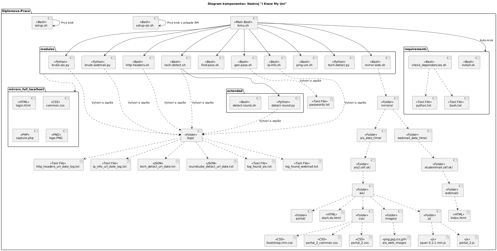
   
  <i>Obrázok 1 Diagram komponentov</i>

# Moduly
Nástroj obsahuje dokopy 7 modulov a na vývoji ďalších sa pracuje. Jednotlivé moduly získavajú citlivé alebo inak užitočné údaje z domén UKF Webmail a AiS. 

## Modul: a) Testovanie odozvy a Rate-limitingu
Tento modul sa zameriava na posielanie GET požiadaviek a kontrolu statusu odpovede a času odozvy. Pomocou tohto modulu môžeme testovať a predpokladať rate-limiting alebo CAPTCHA mechanizmy. 

  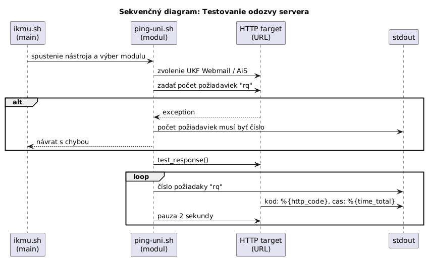
   
  <i>Obrázok 2 Sekvenčný diagram modulu Testovanie odozvy servera a Rate-limiting</i>

## Modul: b) Generovat hesla
Tento modul slúži na generovanie hesla založeného na rodnom čísle. Heslo sa tvorí tak, že sa stanoví prefix odvodený z dátumu narodenia, ku ktorému sa pridávajú kombinácie čísel. Celé číslo musí byť deliteľné číslom 11, aby mohlo predstavovať potenciálne platné rodné číslo a slúžiť ako heslo.

  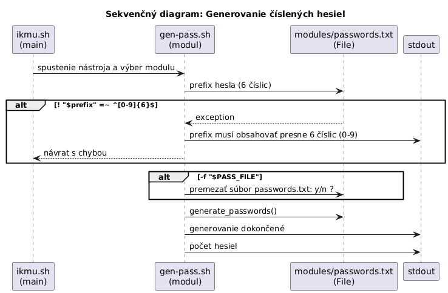
   
  <i>Obrázok 3 Sekvenčný diagram modulu Generovať heslá</i>

## Modul: c) Brute-force na UKF Webmail (python)
Pre tento modul je potrebné zadať `username`, ktoré je buď číslo na ISIC karte alebo emailová adresa študenta. Následne sa odosiela POST požiadavka, ktorá obsahuje username a potencionálne vygenerované heslo z modulu `b) Generovat hesla`. V prípade úspešného prelomenia hesla sa vypíšu údaje: meno, heslo a session ID do konzole a taktiež sa pošlu aj na definovaný Discord server. Následne je možné využiť údaje ako prihlásanie priamo do účtu alebo stačí vložiť ID relácie do cookies pod premenou `roundcube_sessid` a prihlásenie prebehne úspešne, navyše sa tak využíva zranitelnosť Session Hijacking.

Knižnice:
- `requests` — externá knižnica na posielanie HTTP požiadaviek. V našom programe využívame POST požiadavku, ktorá je zodpovedná za odoslanie prihlasovacích formulárov, získanie HTTP stavového kódu a cookies z odpovede.
- `sys` — súčasť štandardnej knižnice Pythonu. V našom programe sa používa na ukončenie programu s konkrétnym návratovým kódom `sys.exit` a na vypisovanie chýb na štandardný chybový výstup `file=sys.stderr`.
- `time` - súčasť štandardnej knižnice Pythonu. Používa sa na vloženie pauzy medzi jednotlivými pokusmi o prihlásenie `time.sleep`, čím sa znižuje riziko, že server zablokuje požiadavky kvôli príliš rýchlemu bruteforce prístupu.
- `random` - súčasť štandardnej knižnice Pythonu. V programe sa používa spolu s `time.sleep` na generovanie náhodného čakania medzi pokusmi `random.uniform(300, 350))` aby požiadavky neprichádzali presne pravidelne a pôsobili menej bot-like.

  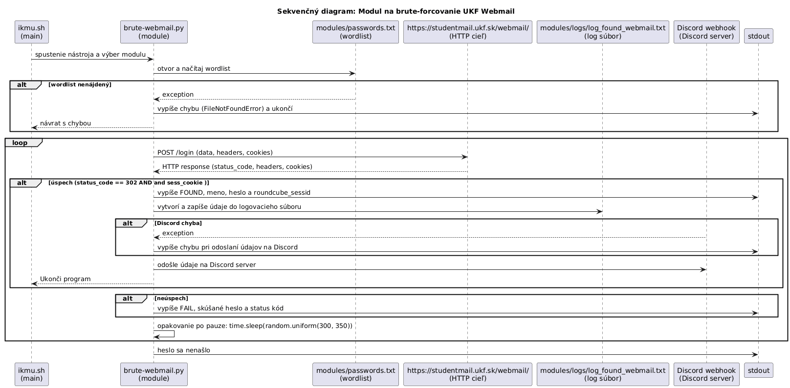
   
  <i>Obrázok 4 Sekvenčný diagram modulu Brute-force na UKF Webmail</i>

  
## Modul: d) Brute-force na UKF AiS (python)
Pre tento modul je potrebné zadať username, ktoré predstavuje naše osobné ID číslo a nájdedme ho na ISICu (emailova adresa pri AiS logine nefunguje). Následne sa odosiela POST požiadavka, ktorá obsahuje username a potencionálne vygenerované heslo z modulu b) Generovat hesla. V prípade úspešného prelomenia hesla sa vypíšu údaje: meno, heslo a session ID do konzole a taktiež sa pošlu aj na definovaný Discord server. Následne je možné využiť údaje ako prihlásanie priamo do účtu alebo stačí vložiť ID relácie do cookies pod premenou `JSESSIONID` a prihlásenie prebehne úspešne. 
Knižnice v tomto programe majú rovnakú funkciu ako v module `c) Brute-force na UKF Webmail (python)`. 

  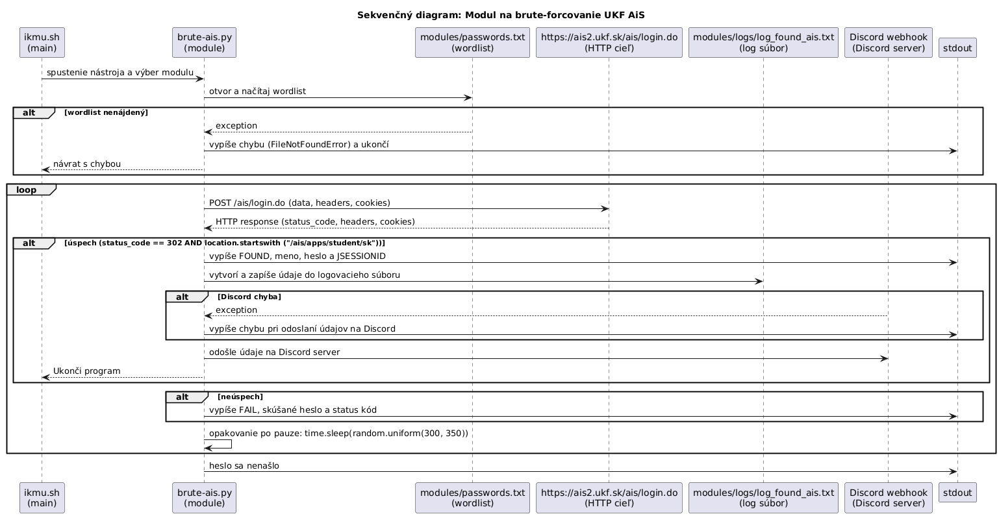
   
  <i>Obrázok 5 Sekvenčný diagram modulu Brute-force na UKF AiS</i>

## Modul: e) Zistenie HTTP hlaviciek
Tento modul zisťuje dostupné HTTP hlavičky zo zoznamu headers. Je možné do zoznamu pridať ďalšie hlavičky a kontrolovať tak bezpečnostné nastavenia servera, čo poskytuje lepší prehľad o jeho konfigurácii.

  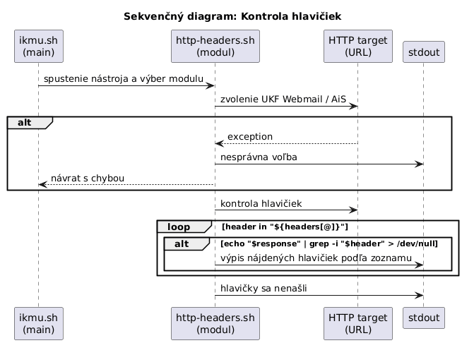
   
  <i>Obrázok 6 Sekvenčný diagram modulu Http-headers</i>

## Modul: f) Zistenie technologii 
Tento modul odošle `HTTP HEAD` a `GET` požiadavky na zvolenú URL adresu (UKF Webmail alebo UKF AiS) a analyzuje odpoveď servera. Na základe hlavičiek a obsahu HTML identifikuje používané technológie, ako napríklad typ webového servera `(nginx, Apache, IIS)`, backendové prostredie `(PHP, Java, Python)` a CMS alebo frameworky `(WordPress, Laravel, React, Roundcube)`. V prípade detekcie Roundcube ponúkne spustenie rozšíreného modulu na jeho overenie.

  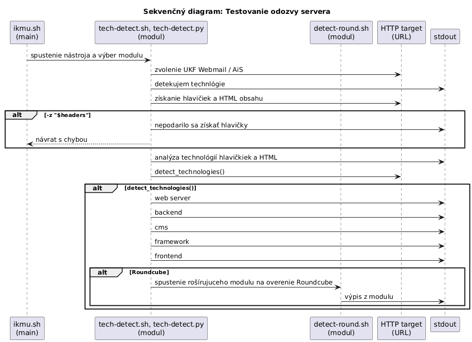
   
  <i> Obrázok 7 Sekvenčný diagram modulu Http-headers </i>

## Modul: g) Zistenie IP adresy a polohy
Tento modul umožňuje vybrať doménu UKF Webmail alebo AiS, zistí jej IP adresu a následne načíta základné informácie o tejto IP pomocou služby `ipinfo.io`.

  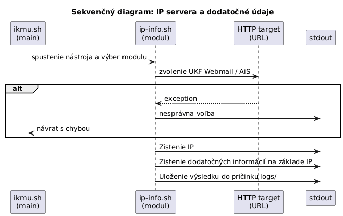
   
  <i> Obrázok 8 Sekvenčný diagram modulu Http-headers </i>

## Modul: i) Hladat heslo vo vytvorenom zozname
Tento modul vyhľadáva zadaný reťazec prostreddníctvom nástroja `grep` a teda heslo vo vytvorenom súbore `passwords.txt` ktoré pochádza z modulu b) Generovat hesla.

  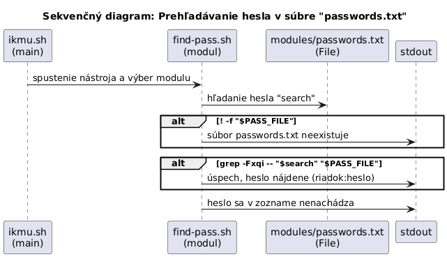
   
  <i> Obrázok 9 Sekvenčný diagram modulu Find-pass</i>

## Modul: j) Zistenie technológií (Python verzia)
Táto verzia modulu predstavuje preprogramovanú implementáciu pôvodného Bashu do jazyka Python 3. Na komunikáciu so serverom využíva knižnicu `requests`, pre spracovanie HTML odpovede knižnicu `BeautifulSoup` z balíka `bs4` a pre detekciu vzorov v texte knižnicu `re (regular expressions)`. Rovnako zisťuje technológie spomenúte v Bash verzií. 

## Modul: k) Mirror web stranky
Tento modul dokáže spraviť frontend kópiu prihlasovacej stránky na UKF Webmail alebo AiS. Kedže neexistuje WAF alebo pravdilo WAF-u, je možné stránku kompletne nakopírovať a ďalej využiť na phishing útok.

## Modul: l) Skenovanie otvorenych portov 
Modul vo vývoji.

## Možnosť h) a možnosť x)
- `h` - vypíše vysvetlivky k jednotlivým modulom.
- `x` - ukončí program

# logs
Obsahuje textové súbory, ktoré obsahujú prihlasovacie údaje v prípade prelomenia hesla.

# extended
Rozšírenie pre určité klasické moduly.

## Extended modul: Zistenie webového klienta v rámci modulu f)
Modul analyzuje webovú aplikáciu a na základe kombinácie cookies, HTML obsahu, známych alebo dynamicky zistených endpointov (?_task=…) a špecifických HTTP hlavičiek identifikuje a potvrdzuje prítomnosť webmail klienta `Roundcube`. 

  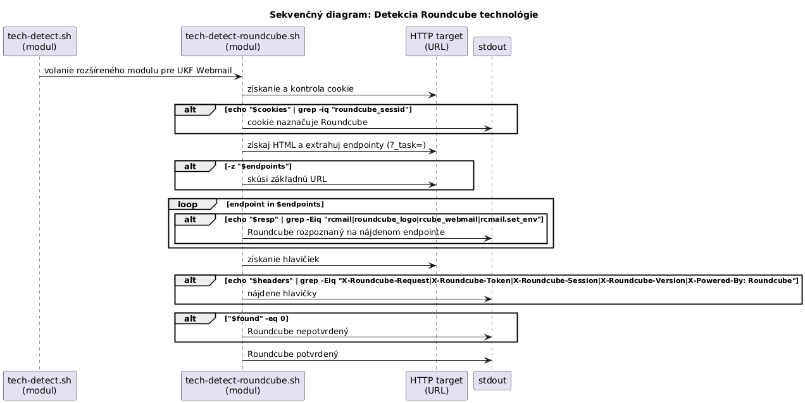
   
  <i> Obrázok 10 Rozšírený moodul na detekciu Roundcube </i>

# mirrors
Priečinok obsahuje kópiu stránok (históriu), vykonané modulom `mirror-web.sh`.

# mirrors_full_localhost
Priečinok obsahuje ukážkovú phishingovú prihlasovaciu stránku, ktorá vznikla po vykonaní modulu `mirror-web.sh` a následnej úprave zdrojového kódu. HTML stránka bola upravená tak, aby neobsahovala žiadne priame prepojenie na doménu UKF Webmail. Obsahuje vlastne css `common.css`, logo a php kód `capture.php`, ktorý tvorí jednoduchý backend pre zachytenie údajov do súboru `logins.txt`.  
Všetky súbory sú uložené v adresári `/var/www/html/webmail`. Pre správnu funkčnosť je potrebné spustiť lokálny Apache server `systemctl start apache2` a je potrebné nastaviť majiteľa apache2 na zapisovanie  `chown -R www-data:www-data /var/www/html/webmail/`. Posledný krok je povoliť zápis `chmod -R 775 /var/www/html/webmail/`. 

  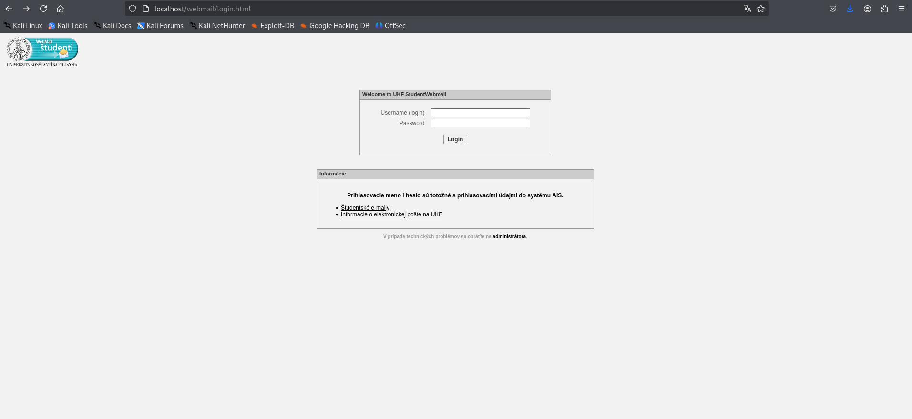
   
  <i>Obrázok 11 Phishing stránka UKF Webmail pre login na lokálnom serveri</i>

  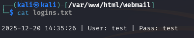
   
  <i>Obrázok 12 Zachytené údaje v textovom súbore</i>

Celý tento postup slúži výhradne ako demonštrácia hrozby phishingového útoku, ktorý môže vzniknúť po odzrkadlení legitímnej webovej stránky pomocou modulu `mirror-web.sh` v prípade, že nie sú aplikované ochranné mechanizmy, napríklad WAF pravidlá.

# Použitie nástroja v zariadení Raspberry Pi 
Nástroj je možné využiť aj na menšiom zariadení ako je RPi. 
Postup na inštaláciu a spustenie skriptu je následnový: 
- Ako prvé potrebujeme nainštalovať Raspberry Pi OS na SD kartu, prostredníctvom RPi Imageru, ktorý je dostupný na: `https://www.raspberrypi.com/software/`
- Pre náš projekt sme zvolili zariadenie `RPi 3` a `OS 32-bit`.
- Do zariadenia sa pripájame prostredníctvom nástroja Putty: `https://putty.org/index.html`
- Zadáme IP adresu RPi a SSH port
- Pre SSH prístup na RPi sme nastavili bezpečnostné opatrenia v konfiguračnom súbore SSH a tiež sme nakonfigurovali firewall tak, aby bol prístup povolený len z konkrétnych IP adries.
- V RPi stiahneme Git repozitár `wget https://github.com/majohlavacka/Diplomova-praca`
- Pridelíme spustitelné práva `find . -type f \( -name "*.sh" -o -name "*.py" \) -exec chmod a+x {} +`
- Spustíme nástroj `./ikmu.sh`

  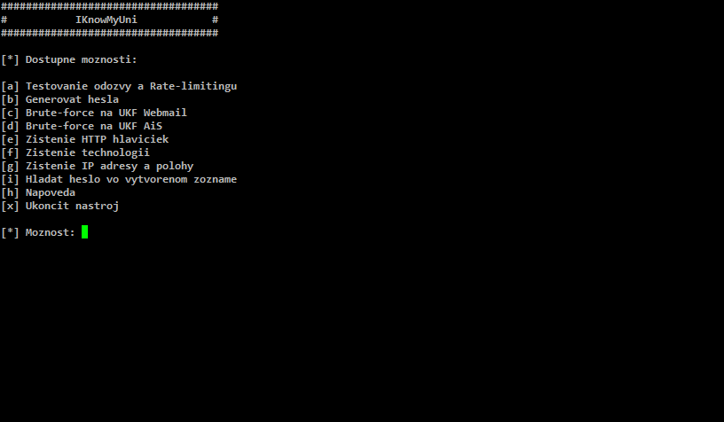
   
  <i>Obrázok 13 Menu nástroja IKMU</i>

## Možný problém pri spustení modulov
Pri spustení môžu nastať errory ako `$'\r': command not found`. Jedná sa o problém, kde skript má Windows konce riadkov (CRLF) (\r), preto shell vidí neexistujúce príkazy ako `clear\r` a `shebang/case` sú poškodené.

### Vyrišenie problému
  1. Vykonaj príkaz: `sudo apt update && sudo apt install -y dos2unix`
  2. Vykonaj príkaz: `find . -type f \( -name "*.sh" -o -name "*.py" \) -exec dos2unix {} +` - konvertuje súbor na Unix konce riadkov
  3. Vykonaj príkaz: `find . -type f \( -name "*.sh" -o -name "*.py" \) -exec chmod a+x {} +`
  4. Spusti: `./ikmu.sh`

# Dôležitá poznámka k projektu
- Projekt slúži výhradne ako prarktická časť diplomovej práce za cieľom poukázať bezpečnostné rizika univerzity a za cieľom ukážky vytvorenia nástroja, určeného na penetračné testovanie
- Autor nenesie žiadnu zodpovednosť za prípadné zneužitie nástroja

# Autor
**MH**

