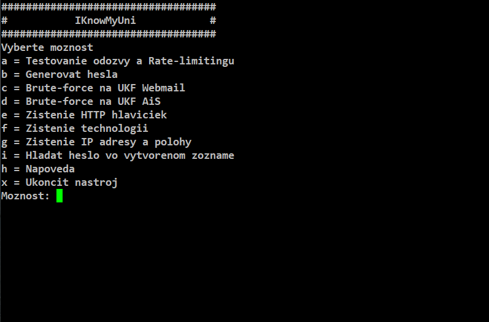

# Diplomová práca
Tento nástroj slúži ako diplomová práca ktorá sa zameriava na penetračné testovanie univerzity UKF. Pri jeho implementácii boli použité programovacie jazyky Bash a Python a testovaný bol v operačných systémoch Kali Linux a Raspbian OS.
Nástroj nesie názov `IKnowMyUni (skrátene IKMU)` a v súčasnosti obsahuje sedem modulov, pričom na vývoji ďalších sa stále pracuje

# Download
- Na stiahnutie treba použiť `wget https://github.com/majohlavacka/Diplomova-praca` a následne treba sprviť súbory .sh a .py spustitelné.
- Vykonajte príkaz `find . -type f \( -name "*.sh" -o -name "*.py" \) -exec chmod a+x {} +`, pričom bodka zabezpečuje to, aby v danom adresáry a podadresároch našiel všetky .sh, .py súbory a pridelil im príkazom `chmod a+x` spustitelné práva. 

# Hlavný program 
Hlavný program nesie názov `ikmu.sh` a jeho spustenie je možné 2 spôsobmi `./ikmu.sh` alebo `bash ikmu.sh`. Pre vysvetlívky je treba pridať ešte `-h` alebo `--help`, napr. `./ikmu.sh -h`. 
Obsahuje hlavné menu, ktoré volá jednotlivé možnosti.

# Moduly
Nástroj obsahuje dokopy 7 modulov a na vývoji ďalších sa pracuje. Jednotlivé moduly získavajú citlivé alebo inak užitočné údaje z domén UKF Webmail a AiS. 

## Modul: a) Testovanie odozvy a Rat
Tento modul sa zameriava na posielanie GET požiadaviek a kontrolu statusu odpovede a času odozvy. Pomocou tohto modulu môžeme testovať a predpokladať rate-limiting alebo CAPTCHA mechanizmy. 

## Modul: b) Generovat hesla
Tento modul slúži na generovanie hesla založeného na rodnom čísle. Heslo sa tvorí tak, že sa stanoví prefix odvodený z dátumu narodenia, ku ktorému sa pridávajú kombinácie čísel. Celé číslo musí byť deliteľné číslom 11, aby mohlo predstavovať potenciálne platné rodné číslo a slúžiť ako heslo.

## Modul: c) Brute-force na UKF Webmail
Pre tento modul je potrebné zadať username, ktoré je buď číslo na ISIC karte alebo emailová adresa študenta. Následne sa odosiela POST požiadavka, ktorá obsahuje username a potencionálne vygenerované heslo z modulu b) Generovat hesla. V prípade úspešného prelomenia hesla sa vypíšu údaje: meno, heslo a session ID do konzole a taktiež sa pošlu aj na definovaný Discord server. Následne je možné využiť údaje ako prihlásanie priamo do účtu alebo stačí vložiť ID relácie do cookies pod premenou `roundcube_sessid` a prihlásenie prebehne úspešne, navyše sa tak využíva zranitelnosť Session Hijacking.

## Modul: d) Brute-force na UKF AiS
Na vývoji sa pracuje.

## Modul: e) Zistenie HTTP hlaviciek
Tento modul zisťuje dostupné HTTP hlavičky zo zoznamu headers. Je možné do zoznamu pridať ďalšie hlavičky a kontrolovať tak bezpečnostné nastavenia servera, čo poskytuje lepší prehľad o jeho konfigurácii.

## Modul: f) Zistenie technologii 
Tento modul odošle HEAD požiadavku na zvolenú URL a na základe analýzy HTTP hlavičiek (Server, X-Powered-By, Set-Cookie) identifikuje používané technológie (napr. WordPress, PHP) a typ webového servera (nginx alebo Apache).

## Modul: g) Zistenie IP adresy a polohy
Tento modul umožňuje vybrať doménu UKF Webmail alebo AiS, zistí jej IP adresu a následne načíta základné informácie o tejto IP pomocou služby `ipinfo.io`.

## Modul: i) Hladat heslo vo vytvorenom zozname
Tento modul vyhľadáva zadaný reťazec prostreddníctvom nástroja `grep` a teda heslo vo vytvorenom súbore `passwords.txt` ktoré pochádza z modulu b) Generovat hesla.

## Možnosť h) a možnosť x)
- `h` - vypíše vysvetlivky k jednotlivým modulom.
- `x` - ukončí program

# Použitie nástroja v zariadení Raspberry Pi 
Nástroj je možné využiť aj na menšiom zariadení ako je RPi. 
Postup na inštaláciu a spustenie skriptu je následnový: 
- Ako prvé potrebujeme nainštalovať Raspberry Pi OS na SD kartu, prostredníctvom RPi Imageru, ktorý je dostupný na: `https://www.raspberrypi.com/software/`
- Pre náš projekt sme zvolili zariadenie `RPi 3` a `OS 32-bit`.
- Do zariadenia sa pripájame prostredníctvom nástroja Putty: `https://putty.org/index.html`
- Zadáme IP adresu RPi a SSH port
- Pre SSH prístup na RPi sme nastavili bezpečnostné opatrenia v konfiguračnom súbore SSH a tiež sme nakonfigurovali firewall tak, aby bol prístup povolený len z konkrétnych IP adries.
- V RPi stiahneme Git repozitár `wget https://github.com/majohlavacka/Diplomova-praca`
- Pridelíme spustitelné práva `find . -type f \( -name "*.sh" -o -name "*.py" \) -exec chmod a+x {} +`
- Spustíme nástroj `./ikmu.sh`

  
   
  <i>Obrázok 1 Menu nástroja IKMU</i>

## Možný problém pri spustení modulov
Pri spustení môžu nastať errory ako `$'\r': command not found`. Jedná sa o problém, kde skript má Windows konce riadkov (CRLF) (\r), preto shell vidí neexistujúce príkazy ako `clear\r` a `shebang/case` sú poškodené.

### Vyrišenie problému
  1. Vykonaj príkaz: `sudo apt update && sudo apt install -y dos2unix`
  2. Vykonaj príkaz: `find . -type f \( -name "*.sh" -o -name "*.py" \) -exec dos2unix {} +` - konvertuje súbor na Unix konce riadkov
  3. Vykonaj príkaz: `find . -type f \( -name "*.sh" -o -name "*.py" \) -exec chmod a+x {} +`
  4. Spusti: `./ikmu.sh`

# Dôležitá poznámka k projektu
- Projekt slúži výhradne ako prarktická časť diplomovej práce za cieľom poukázať bezpečnostné rizika univerzity a za cieľom ukážky vytvorenia nástroja, určeného na penetračné testovanie
- Autor nenesie žiadnu zodpovednosť za prípadné zneužitie nástroja

# Autor
MH

